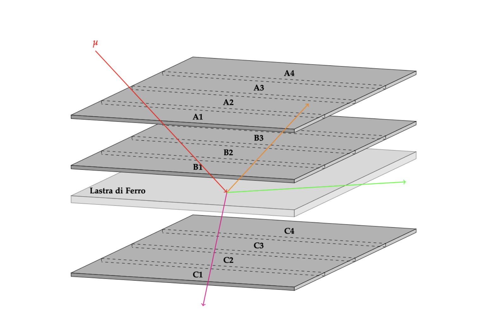
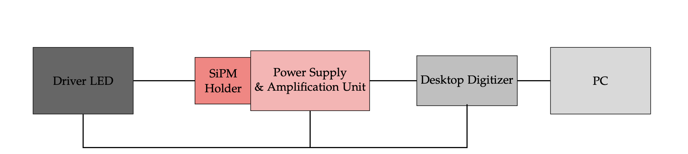
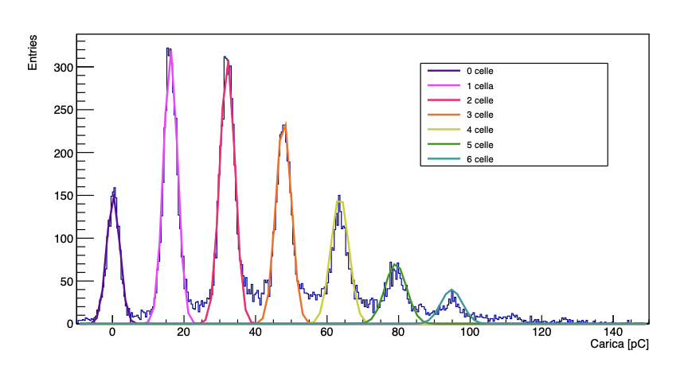
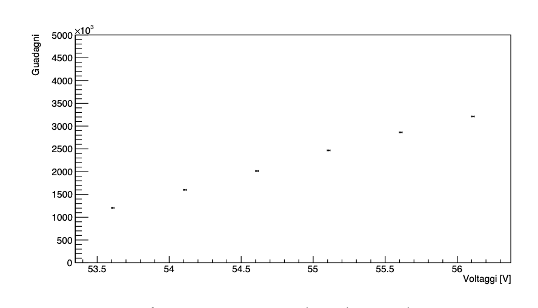
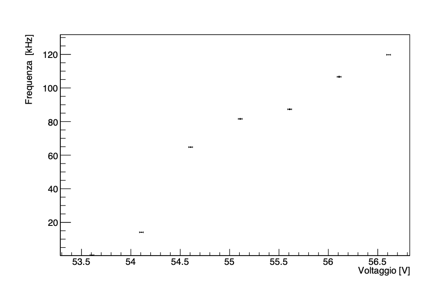

# Muon Detection Experiment

This repository contains resources and documentation for a physics experiment aimed at detecting cosmic muons and measuring their lifetime using scintillators and Silicon Photomultipliers (SiPMs).

---

# 🧪 Muon Lifetime Measurement Laboratory

## 📌 Abstract
This laboratory experiment aims to estimate the **mean lifetime of the muon** (τμ) via its primary weak decay channel:

> **μ⁻ → e⁻ + ν̅e + νμ**

The setup uses cosmic ray muons, detected and analyzed via **plastic scintillators**, **photomultiplier tubes (PMTs)**, and a **NIM/VME** electronics chain. The decay time distribution is studied to extract τμ, validating the exponential decay law and relativistic effects.

---

## 🎯 Objectives
- Determine the muon lifetime (τμ) from cosmic ray interactions.
- Analyze decay-time statistics and test the exponential decay model.
- Compare experimental results to the Particle Data Group (PDG) reference.

---

## 🧰 Experimental Setup

| Component         | Description                                                                 |
|------------------|-----------------------------------------------------------------------------|
| **Scintillators** | 12 plastic scintillators arranged in 3 planes (A, B, C).                    |
| **Absorber**      | Iron slab between planes B and C to stop incoming muons.                    |
| **Detectors**     | PMTs coupled to each scintillator, converting light to electronic pulses.   |
| **Electronics**   | NIM & VME crates, logic units, discriminators, dual timers, delay modules.  |
| **DAQ System**    | Flash ADC (CAEN v1720) + CAENScope software, data processed in ROOT.        |

Here follows a schematic representation of the three planes of scintillators: 

  <em>Figure 1: Schematic representations of the three planes of scintillators</em>

---

## 🔬 Procedure Overview

### 1. 📊 Scintillator Efficiency Calibration
- **Method**: Triple-coincidence between A1, B1, C1 to compute B1 efficiency:

- Efficiency curve fitted with an **error function** (Gaussian approximation).
- Optimal operating range: **1500–1800 V**, with **εB ≈ 0.8**.

### 2. ⚙️ Coincidence Logic & Triggering
- **START signal**: A ∩ B ∩ ¬C — muon enters and stops in iron.
- **STOP1**: A ∩ B ∩ Gate — decay particle exits upward (preferred).
- **STOP2**: C ∩ Gate — decay particle exits downward (no coincidence).
- **Trigger**: OR(STOP1, STOP2) with retroactive capture.
- **Gate**: 10 μs window, delayed by 85.5 ns to avoid false START/STOP overlaps.

### 3. 🧾 Data Acquisition
- **Sampling rate**: 250 MSa/s (4 ns/sample), 12-bit resolution.
- Signals converted from NIM (single-ended) to differential for ADC input.
- **Each event**: 8192 samples stored for START and STOP signals.

### 4. 📈 Data Analysis
- Use of **ROOT** to extract START and STOP timestamps.
- Histogram of decay times fitted with:
** N(t) = p0 · exp(−t / p1) + p2 ** 

where **p₁ ≈ τμ**, and **p₂** accounts for background.

- ✅ **Extracted Lifetime**:

  <em>Figure 2: Exponential fit to calculate the lifetime.</em>

  <em>Figure 3: Histograms of decay times using STOP2.</em> 

---

## 🧾 Conclusion
- The measured value is in good agreement with the **PDG reference value** (~2197 ns).
- **STOP1 channel** offers greater accuracy due to dual-plane coincidence.
- The **STOP2 channel** is more susceptible to background and timing errors.
- The experiment confirms both **exponential decay law** and **relativistic time dilation** in cosmic muons.

---

## 📚 References

1. **Particle Data Group**, *Review of Particle Physics*, Phys. Rev. D 110, 030001 (2024)  
2. **CAEN**, [Modular Pulse Processing Electronics](https://www.caen.it)  
3. **W.R. Leo**, *Techniques for Nuclear and Particle Physics Experiments*, Springer (1994)  
4. **Agilent U1241B**, Voltmeter Specifications  
5. **G. D'Agostini**, *Bayesian Reasoning in Data Analysis*, World Scientific (2003)

---

> 📁 *For plots, raw data, and scripts, see the [`/data`](./data) and [`/scripts`](./Scripts) directories.*

# 💡 Characterization of Inorganic Scintillators: LYSO and PWO

Scintillators are materials that emit light (photons) when they are excited by ionizing radiation, such as when a muon passes through them. These materials are essential in detecting the passage of muons in our setup.

## Overview

This project investigates two inorganic scintillator crystals — LYSO (Lutetium Yttrium Orthosilicate) and PWO (Lead Tungstate) — to characterize their performance as radiation detectors. The key parameters studied are **light output (LO)** and **decay time (τ)** under different conditions, including internal radioactivity and cosmic ray interactions.

## Experimental Setup

- **Photomultiplier Tubes (PMTs)** were used to detect light from scintillation events and convert them into measurable electric signals.
- Custom electronics and software (based on ROOT and oscilloscopic acquisition) were employed to analyze the digitized signal waveforms.
- A gain calibration of the PMT was performed using low-intensity LED signals to isolate single photoelectron responses.
- A signal attenuator was included for high-amplitude events.

## Scintillators Tested

- **LYSO**:
  - Exhibits intrinsic radioactivity due to the isotope ¹⁷⁶Lu.
  - Both internal decay events and cosmic ray interactions were analyzed.
- **PWO**:
  - No intrinsic radioactivity; only cosmic ray interactions studied.

## Key Results

| Scintillator | Source            | Decay Time (τ) [ns] | Light Output (LO) [MeV⁻¹] |
|--------------|-------------------|----------------------|----------------------------|
| LYSO         | Internal decay    | 46.15 ± 0.01         | 779 ± 8                    |
| LYSO         | Cosmic muons      | 47.39 ± 0.02         | 680 ± 10                   |
| PWO          | Cosmic muons      | 20.93 ± 0.003        | 5.65 ± 0.06                |

## Observations

- LYSO has a significantly higher light output than PWO, making it ideal for high-resolution calorimetric applications.
- The decay time of LYSO is longer, which can be a limitation for fast-timing experiments.
- Minor discrepancies between measurements for LYSO under different conditions are attributed to slight variations in optical coupling with the PMT.

## References

- [Particle Data Group, 2024](https://doi.org/10.1103/PhysRevD.110.030001)  
- [Luxium Solutions: LYSO Material Data](https://www.luxiumsolutions.com/radiation-detection-scintillators/crystal-scintillators/lyso-scintillation-crystals)  
- [EJNMMI Physics on LYSO Radioactivity](https://doi.org/10.1186/s40658-020-00291-1)

---

# 🔬 SiPM Characterization with LED Driver

## 📖 Introduction

This project performs a full characterization of a **Silicon Photomultiplier (SiPM)** using a controlled pulsed light source from a **CAEN SP5601 LED Driver**. The analysis focuses on two key properties of the SiPM:

- The **gain (G)** — i.e., the amplification factor relating detected photons to electric charge
- The **dark count rate (f)** — spontaneous noise events occurring in the absence of light

The SiPM response is analyzed using ROOT, based on digitized signals from a CAEN DT5720A ADC module.

---

## 📘 Scientific Background

### What is a SiPM?

A **Silicon Photomultiplier (SiPM)** is a solid-state photon detector made of thousands of microcells operating in **Geiger mode**. Each cell is a reverse-biased p–n junction that, when struck by a photon, triggers a self-sustained avalanche of charge carriers.

Key characteristics:
- High photon detection efficiency (PDE)
- Sub-nanosecond timing resolution
- Operates at low voltage (30–60 V)
- Gain ~10⁵–10⁶
- Immune to magnetic fields

---

## 📊 Experiment Goals

1. **Measure the SiPM Gain** as a function of the applied bias voltage.
2. **Determine the Dark Count Rate (DCR)** for various acquisition times and voltages.
3. **Develop and validate analysis methods** using baseline correction and signal integration.
4. **Visualize photoelectron peaks** and their statistics through ROOT.

---

## ⚙️ Experimental Setup

The system includes:

- **SiPM Detector (SP5650C)**: connected to an optical fiber receiving LED pulses.
- **LED Driver (CAEN SP5601)**: emits controlled light pulses at 400 nm with 8 ns pulse width.
- **Amplifier & Power Supply (CAEN SP5600)**: provides bias voltage and amplification.
- **Digitizer (CAEN DT5720A)**: samples incoming analog waveforms at 250 MSa/s.
- **ROOT**: processes waveform data to extract charge and perform statistical analysis.

Here follows a schematic representation of the experimental setup:

  <em>Figure : Schematic representation of the experimental setup.</em>

 

---

## 📐 Theory

### 1. Signal Integration — Charge \( Q \)

The SiPM output signal is digitized into an array of voltage samples. The total charge \( Q \) deposited in one event is:

Q = ∑[i_min, i_max] (V[i] × Δt) / R

- `V[i]`: signal voltage at time index `i` (in mV)
- `Δt = 4 ns`: sampling interval
- `R = 50 Ω`: input impedance
- Output unit: picocoulombs (pC)

  <em>Figure : Histogram containing the values of the charge calculated for a bias voltage of 55.11V with gaussian fits for every peak.</em>

 

### 2. Gain Calculation — \( G \)

To find the gain, we analyze the photoelectron spectrum (discrete charge peaks). Gain is derived from the slope of charge vs. number of cells fired:

G = (m / qₑ) × 10^(A / 20)

- `m`: slope of charge vs. number of photoelectrons
- `qₑ = 1.602 × 10⁻¹⁹ C`: elementary charge
- `A`: amplifier attenuation in decibels (e.g., 32 dB)

  <em>Figure: Gain vs bias voltage.</em>

 

### 3. Dark Count Rate — \( f \)

Measured as the frequency of noise events in absence of light:

f = λ / T

- `λ`: mean value from a Poisson fit to count histogram
- `T`: acquisition window duration (e.g., 16k samples × 4 ns)

  <em>Figure: Dark count frequency vs voltage.</em>

 

---

## 🧪 Authors & Contributions

This project is maintained by a group of physics students and educators passionate about particle detection. Contributions and feedback are welcome!

