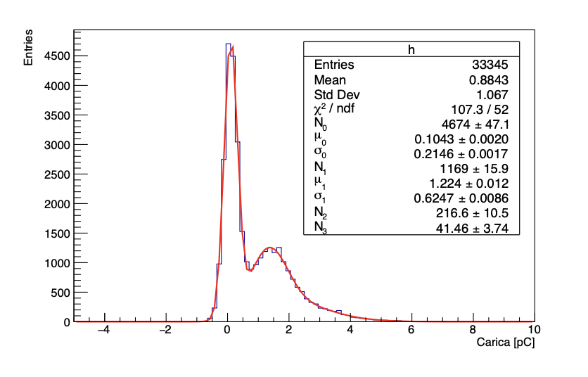
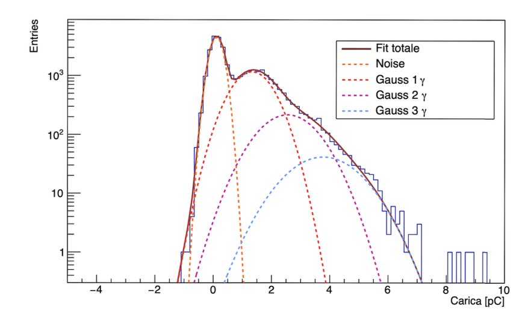
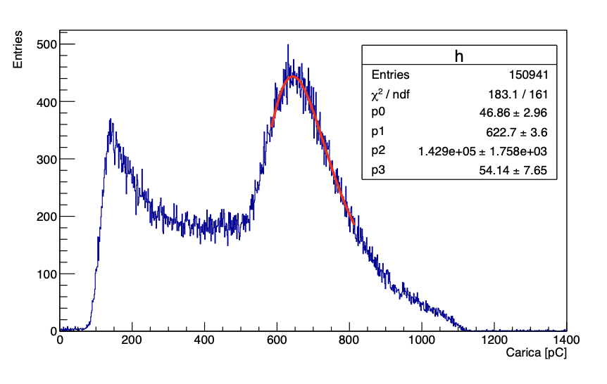
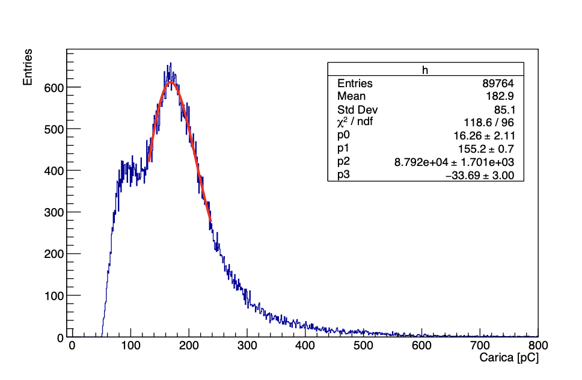

# 🧪 Muon Lifetime Measurement Laboratory

## 📌 Abstract
This laboratory experiment aims to estimate the **mean lifetime of the muon** (τμ) via its primary weak decay channel:

> **μ⁻ → e⁻ + ν̅e + νμ**

The setup uses cosmic ray muons, detected and analyzed via **plastic scintillators**, **photomultiplier tubes (PMTs)**, and a **NIM/VME** electronics chain. The decay time distribution is studied to extract τμ, validating the exponential decay law and relativistic effects.

---

## 🎯 Objectives
- Determine the muon lifetime (τμ) from cosmic ray interactions.
- Analyze decay-time statistics and test the exponential decay model.
- Compare experimental results to the Particle Data Group (PDG) reference.

---

## 🧰 Experimental Setup

| Component         | Description                                                                 |
|------------------|-----------------------------------------------------------------------------|
| **Scintillators** | 12 plastic scintillators arranged in 3 planes (A, B, C).                    |
| **Absorber**      | Iron slab between planes B and C to stop incoming muons.                    |
| **Detectors**     | PMTs coupled to each scintillator, converting light to electronic pulses.   |
| **Electronics**   | NIM & VME crates, logic units, discriminators, dual timers, delay modules.  |
| **DAQ System**    | Flash ADC (CAEN v1720) + CAENScope software, data processed in ROOT.        |

Here follows a schematic representation of the three planes of scintillators: 

  <em>Figure 1: Schematic representations of the three planes of scintillators</em>

---

## 🔬 Procedure Overview

### 1. 📊 Scintillator Efficiency Calibration
- **Method**: Triple-coincidence between A1, B1, C1 to compute B1 efficiency:

- Efficiency curve fitted with an **error function** (Gaussian approximation).
- Optimal operating range: **1500–1800 V**, with **εB ≈ 0.8**.

### 2. ⚙️ Coincidence Logic & Triggering
- **START signal**: A ∩ B ∩ ¬C — muon enters and stops in iron.
- **STOP1**: A ∩ B ∩ Gate — decay particle exits upward (preferred).
- **STOP2**: C ∩ Gate — decay particle exits downward (no coincidence).
- **Trigger**: OR(STOP1, STOP2) with retroactive capture.
- **Gate**: 10 μs window, delayed by 85.5 ns to avoid false START/STOP overlaps.

### 3. 🧾 Data Acquisition
- **Sampling rate**: 250 MSa/s (4 ns/sample), 12-bit resolution.
- Signals converted from NIM (single-ended) to differential for ADC input.
- **Each event**: 8192 samples stored for START and STOP signals.

### 4. 📈 Data Analysis
- Use of **ROOT** to extract START and STOP timestamps.
- Histogram of decay times fitted with:
** N(t) = p0 · exp(−t / p1) + p2 ** 

where **p₁ ≈ τμ**, and **p₂** accounts for background.

- ✅ **Extracted Lifetime**:

  <em>Figure 2: Exponential fit to calculate the lifetime.</em>

  <em>Figure 3: Histograms of decay times using STOP2.</em> 

---

## 🧾 Conclusion
- The measured value is in good agreement with the **PDG reference value** (~2197 ns).
- **STOP1 channel** offers greater accuracy due to dual-plane coincidence.
- The **STOP2 channel** is more susceptible to background and timing errors.
- The experiment confirms both **exponential decay law** and **relativistic time dilation** in cosmic muons.

---

## 📚 References

1. **Particle Data Group**, *Review of Particle Physics*, Phys. Rev. D 110, 030001 (2024)  
2. **CAEN**, [Modular Pulse Processing Electronics](https://www.caen.it)  
3. **W.R. Leo**, *Techniques for Nuclear and Particle Physics Experiments*, Springer (1994)  
4. **Agilent U1241B**, Voltmeter Specifications  
5. **G. D'Agostini**, *Bayesian Reasoning in Data Analysis*, World Scientific (2003)

---

> 📁 *For plots, raw data, and scripts, see the [`/data`](./data) and [`/scripts`](./Scripts) directories.*

# 🌟 Inorganic Scintillator Characterization: LYSO and PWO

## 📋 Abstract

This project characterizes two inorganic scintillator crystals, **LYSO** and **PWO**, focusing on their performance under internal radioactivity and cosmic muon excitation. The analysis evaluates key parameters such as:

- **Light Output (LO)**: the number of photoelectrons per MeV of deposited energy
- **Decay Time (τ)**: time constant of scintillation light emission

Measurements are performed using a photomultiplier tube (PMT) coupled to each crystal, with signal acquisition handled by a flash ADC and data analyzed using ROOT.

---

## 🧪 Motivation

Inorganic scintillators are widely used in high-energy physics, medical imaging, and nuclear detection due to their excellent energy resolution and high density. Understanding their **light production efficiency** and **timing response** is critical for system optimization.

---

## ⚙️ Experimental Setup

- **Photomultiplier Tube (PMT)**: Converts scintillation light into electrical signals
- **Crystals**:
  - **LYSO (Lu₂(1−x)Y₂xSiO₅)**: High density, internal radioactivity from ¹⁷⁶Lu decay
  - **PWO (PbWO₄)**: No intrinsic radioactivity, fast decay time
- **Signal Processing**:
  - Flash ADC (250 MSa/s, 12-bit resolution)
  - Data stored as waveforms (1024 samples per event)

Signal amplification, attenuation, and synchronization are controlled via CAEN electronics (N147, N472, etc.).

---

## 📐 Theoretical Framework

### ✅ Charge Calculation

The charge \( Q \) collected by the PMT is calculated by:

Q = ∑[i_min, i_max] (V[i] × Δt) / R

- \( V[i] \): signal amplitude in mV
- \( Δt = 4\,ns \)
- \( R = 50\,Ω \)
- Result: \( Q \) in picoCoulombs (pC)

  <em>Figure : Multigaussian fit for charge spectrum.</em>

  <em>Figure : Multigaussian fit for charge spectrum in log scale.</em>

### ✅ PMT Gain

The gain \( G \) is calculated from LED calibration data as:

G = (μ₀ + μ₁) / e

Where:
- \( μ₀ \): baseline offset
- \( μ₁ \): mean charge from one photoelectron
- \( e \): electron charge

### ✅ Light Output

From:
LO = Q / (e × G × E)

Where:
- \( Q \): measured charge
- \( G \): PMT gain
- \( E \): energy deposited

### ✅ Attenuation Factor

From square wave calibration:

A[dB] = 20 × log₁₀(V_noAtt / V_att)

### Charge spectrum for LYSO and PWO 

  <em>Figure : Internal decay charge spectrum fto lyso. </em>

  <em>Figure : Muon charge spectrum for LYSO.</em>

  <em>Figure : Muon charge spectrum for PWO</em>

### ✅ Decay Time

Scintillation decay modeled as:

N(t) = N₀ · exp(−t / τ)

Fitted per event or from averaged pulses.

---

## 📊 Results

| Parameter                | LYSO (internal) | LYSO (cosmics) | PWO (cosmics) |
|-------------------------|----------------|----------------|----------------|
| **Decay Time (τ)**      | 46.15 ± 0.01 ns | 47.39 ± 0.02 ns | 20.93 ± 0.003 ns |
| **Light Output (LO)**   | 779 ± 8 MeV⁻¹   | 680 ± 10 MeV⁻¹ | 5.65 ± 0.06 MeV⁻¹ |

- LYSO shows measurable internal radioactivity due to ¹⁷⁶Lu decay.
- PWO has faster decay and lower LO, suitable for high-rate applications.
- Decay times are consistent across sources, confirming intrinsic timing properties.

## 📚 References

1. Particle Data Group, *Review of Particle Physics*, **Phys. Rev. D 110**, 030001 (2024).  
   [https://pdg.lbl.gov](https://pdg.lbl.gov)

2. Luxium Solutions, *LYSO:Ce Scintillation Crystals*, Product Specifications.  
   [https://www.luxiumsolutions.com/radiation-detection-scintillators/crystal-scintillators/lyso-scintillation-crystals](https://www.luxiumsolutions.com/radiation-detection-scintillators/crystal-scintillators/lyso-scintillation-crystals)

3. Enríquez-Mier y Terán, F., González-Montoro, A., Hernández-Tamames, J.A., *Characterization of LYSO and BGO scintillators for PET systems*, **EJNMMI Physics**, 2020, 7(1):21.  
   DOI: [10.1186/s40658-020-00291-1](https://doi.org/10.1186/s40658-020-00291-1)

4. W.R. Leo, *Techniques for Nuclear and Particle Physics Experiments*, 2nd Edition, Springer-Verlag (1994).  
   ISBN: 978-3-540-57639-3

5. CAEN Educational Kit Manuals (SP5600, N1470, N472), [https://www.caen.it](https://www.caen.it)

6. G. D'Agostini, *Bayesian Reasoning in Data Analysis: A Critical Introduction*, World Scientific (2003).  
   ISBN: 978-9812383562

---

---

# 🔬 SiPM Characterization with LED Driver

## 📖 Introduction

This project performs a full characterization of a **Silicon Photomultiplier (SiPM)** using a controlled pulsed light source from a **CAEN SP5601 LED Driver**. The analysis focuses on two key properties of the SiPM:

- The **gain (G)** — i.e., the amplification factor relating detected photons to electric charge
- The **dark count rate (f)** — spontaneous noise events occurring in the absence of light

The SiPM response is analyzed using ROOT, based on digitized signals from a CAEN DT5720A ADC module.

---

## 📘 Scientific Background

### What is a SiPM?

A **Silicon Photomultiplier (SiPM)** is a solid-state photon detector made of thousands of microcells operating in **Geiger mode**. Each cell is a reverse-biased p–n junction that, when struck by a photon, triggers a self-sustained avalanche of charge carriers.

Key characteristics:
- High photon detection efficiency (PDE)
- Sub-nanosecond timing resolution
- Operates at low voltage (30–60 V)
- Gain ~10⁵–10⁶
- Immune to magnetic fields

---

## 📊 Experiment Goals

1. **Measure the SiPM Gain** as a function of the applied bias voltage.
2. **Determine the Dark Count Rate (DCR)** for various acquisition times and voltages.
3. **Develop and validate analysis methods** using baseline correction and signal integration.
4. **Visualize photoelectron peaks** and their statistics through ROOT.

---

## ⚙️ Experimental Setup

The system includes:

- **SiPM Detector (SP5650C)**: connected to an optical fiber receiving LED pulses.
- **LED Driver (CAEN SP5601)**: emits controlled light pulses at 400 nm with 8 ns pulse width.
- **Amplifier & Power Supply (CAEN SP5600)**: provides bias voltage and amplification.
- **Digitizer (CAEN DT5720A)**: samples incoming analog waveforms at 250 MSa/s.
- **ROOT**: processes waveform data to extract charge and perform statistical analysis.

Here follows a schematic representation of the experimental setup:

  <em>Figure : Schematic representation of the experimental setup.</em>

 

---

## 📐 Theory

### 1. Signal Integration — Charge \( Q \)

The SiPM output signal is digitized into an array of voltage samples. The total charge \( Q \) deposited in one event is:

Q = ∑[i_min, i_max] (V[i] × Δt) / R

- `V[i]`: signal voltage at time index `i` (in mV)
- `Δt = 4 ns`: sampling interval
- `R = 50 Ω`: input impedance
- Output unit: picocoulombs (pC)

  <em>Figure : Histogram containing the values of the charge calculated for a bias voltage of 55.11V with gaussian fits for every peak.</em>

 

### 2. Gain Calculation — \( G \)

To find the gain, we analyze the photoelectron spectrum (discrete charge peaks). Gain is derived from the slope of charge vs. number of cells fired:

G = (m / qₑ) × 10^(A / 20)

- `m`: slope of charge vs. number of photoelectrons
- `qₑ = 1.602 × 10⁻¹⁹ C`: elementary charge
- `A`: amplifier attenuation in decibels (e.g., 32 dB)

  <em>Figure: Gain vs bias voltage.</em>

 

### 3. Dark Count Rate — \( f \)

Measured as the frequency of noise events in absence of light:

f = λ / T

- `λ`: mean value from a Poisson fit to count histogram
- `T`: acquisition window duration (e.g., 16k samples × 4 ns)

  <em>Figure: Dark count frequency vs voltage.</em>

 

---

## 🧪 Authors & Contributions

This project is maintained by a group of physics students and educators passionate about particle detection. Contributions and feedback are welcome!

