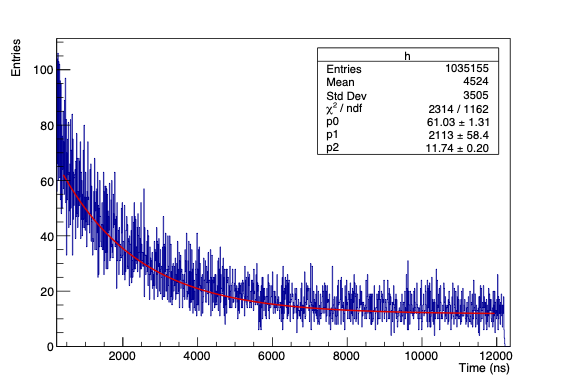
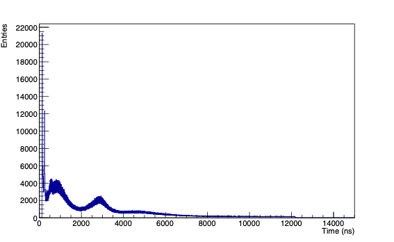

# Muon Detection Experiment

This repository contains resources and documentation for a physics experiment aimed at detecting cosmic muons and measuring their lifetime using scintillators and Silicon Photomultipliers (SiPMs).

---

# 🧪 Muon Lifetime Measurement Laboratory

## 📌 Abstract
This laboratory experiment aims to estimate the **mean lifetime of the muon** (τμ) via its primary weak decay channel:

> **μ⁻ → e⁻ + ν̅e + νμ**

The setup uses cosmic ray muons, detected and analyzed via **plastic scintillators**, **photomultiplier tubes (PMTs)**, and a **NIM/VME** electronics chain. The decay time distribution is studied to extract τμ, validating the exponential decay law and relativistic effects.

---

## 🎯 Objectives
- Determine the muon lifetime (τμ) from cosmic ray interactions.
- Analyze decay-time statistics and test the exponential decay model.
- Compare experimental results to the Particle Data Group (PDG) reference.

---

## 🧰 Experimental Setup

| Component         | Description                                                                 |
|------------------|-----------------------------------------------------------------------------|
| **Scintillators** | 12 plastic scintillators arranged in 3 planes (A, B, C).                    |
| **Absorber**      | Iron slab between planes B and C to stop incoming muons.                    |
| **Detectors**     | PMTs coupled to each scintillator, converting light to electronic pulses.   |
| **Electronics**   | NIM & VME crates, logic units, discriminators, dual timers, delay modules.  |
| **DAQ System**    | Flash ADC (CAEN v1720) + CAENScope software, data processed in ROOT.        |

---

## 🔬 Procedure Overview

### 1. 📊 Scintillator Efficiency Calibration
- **Method**: Triple-coincidence between A1, B1, C1 to compute B1 efficiency:

- Efficiency curve fitted with an **error function** (Gaussian approximation).
- Optimal operating range: **1500–1800 V**, with **εB ≈ 0.8**.

### 2. ⚙️ Coincidence Logic & Triggering
- **START signal**: A ∩ B ∩ ¬C — muon enters and stops in iron.
- **STOP1**: A ∩ B ∩ Gate — decay particle exits upward (preferred).
- **STOP2**: C ∩ Gate — decay particle exits downward (no coincidence).
- **Trigger**: OR(STOP1, STOP2) with retroactive capture.
- **Gate**: 10 μs window, delayed by 85.5 ns to avoid false START/STOP overlaps.

### 3. 🧾 Data Acquisition
- **Sampling rate**: 250 MSa/s (4 ns/sample), 12-bit resolution.
- Signals converted from NIM (single-ended) to differential for ADC input.
- **Each event**: 8192 samples stored for START and STOP signals.

### 4. 📈 Data Analysis
- Use of **ROOT** to extract START and STOP timestamps.
- Histogram of decay times fitted with:

where **p₁ ≈ τμ**, and **p₂** accounts for background.

- ✅ **Extracted Lifetime**:

  <em>Figura 1: Fit esponenziale dei tempi di vita</em>

  <em>Figura 2: Istogramma dei tempi di stop 2</em> 

---

## 🧾 Conclusion
- The measured value is in good agreement with the **PDG reference value** (~2197 ns).
- **STOP1 channel** offers greater accuracy due to dual-plane coincidence.
- The **STOP2 channel** is more susceptible to background and timing errors.
- The experiment confirms both **exponential decay law** and **relativistic time dilation** in cosmic muons.

---

## 📚 References

1. **Particle Data Group**, *Review of Particle Physics*, Phys. Rev. D 110, 030001 (2024)  
2. **CAEN**, [Modular Pulse Processing Electronics](https://www.caen.it)  
3. **W.R. Leo**, *Techniques for Nuclear and Particle Physics Experiments*, Springer (1994)  
4. **Agilent U1241B**, Voltmeter Specifications  
5. **G. D'Agostini**, *Bayesian Reasoning in Data Analysis*, World Scientific (2003)

---

> 📁 *For plots, raw data, and scripts, see the [`/data`](./data) and [`/scripts`](./scripts) directories.*

## 💡 Scintillators

Scintillators are materials that emit light (photons) when they are excited by ionizing radiation, such as when a muon passes through them. These materials are essential in detecting the passage of muons in our setup.

- Common materials: plastic or inorganic crystals (e.g., NaI(Tl))
- Emit photons in response to charged particles
- Coupled to light sensors (e.g., SiPMs) for readout

---

## 📷 Silicon Photomultipliers (SiPM)

SiPMs are highly sensitive light detectors used to detect the small flashes of light produced by scintillators. They are compact, solid-state devices with excellent timing resolution.

- Operate in Geiger mode to detect single photons
- Used for timing and energy measurements
- Ideal for portable or compact detector systems

---

## 📁 Contents

- `/src`: source code for data acquisition and analysis
- `/docs`: detailed documentation and references
- `/images`: high-resolution versions of figures and experimental setup

---

## 🧪 Authors & Contributions

This project is maintained by a group of physics students and educators passionate about particle detection. Contributions and feedback are welcome!

